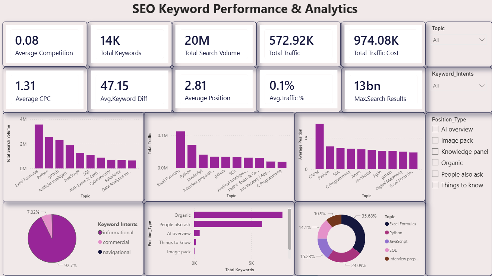

# SEO Keyword Performance & Analytics

## 📌 Project Overview

This project analyzes SEO keyword performance to identify high-demand topics, search behavior, traffic opportunities, and keyword-level performance.

The analysis combines SQL, Power BI, Python, and Machine Learning to transform raw keyword data into actionable SEO insights.

---

## 🎯 Business Problem

SEO teams manage thousands of keywords across different topics, search intents, and ranking positions.

The objective of this project is to understand:

- Which topics generate the highest search volume?
- Which keywords have the strongest traffic potential?
- How do keyword difficulty and CPC vary?
- What are the dominant search intents?
- Which keyword segments represent potential SEO opportunities?
- How can keywords be grouped based on their performance characteristics?

---

## 🎯 Project Objectives

- Analyze keyword search volume and traffic performance
- Identify high-performing SEO topics
- Analyze keyword competition and difficulty
- Understand search intent distribution
- Analyze keyword ranking positions
- Segment keywords using Machine Learning
- Build an interactive Power BI dashboard
- Generate actionable business insights

---

## 🛠️ Tools & Technologies

| Tool | Purpose |
|---|---|
| SQL | Data extraction, transformation and analysis |
| Power BI | Interactive dashboard and visualization |
| Python | Exploratory data analysis and preprocessing |
| Pandas | Data manipulation |
| Scikit-learn | Machine Learning |
| K-Means Clustering | Keyword segmentation |
| Excel | Initial data preparation |

---

## 📊 Dataset

The dataset contains SEO keyword-level information including metrics such as:

- Keyword
- Topic
- Search Volume
- Traffic
- Traffic Cost
- CPC
- Keyword Difficulty
- Average Position
- Search Intent
- Position Type
- Search Results

The dataset contains approximately **14,000 keywords**.

---

## 🔍 Data Analysis

The analysis focuses on:

### Keyword Performance

Analysis of:

- Search volume
- Organic traffic
- CPC
- Traffic cost
- Ranking position
- Keyword difficulty

### Topic Analysis

Keywords are grouped into topics to identify areas with higher search demand and traffic potential.

### Search Intent Analysis

Keywords are analyzed across different search intents such as:

- Informational
- Commercial
- Navigational

### Position Analysis

Ranking and position-type data are analyzed to understand the distribution of keywords across different search result features.

---

## 🤖 Machine Learning

K-Means clustering is used to segment keywords based on their performance characteristics.

The segmentation considers relevant numerical features such as:

- Search volume
- Traffic
- CPC
- Keyword difficulty
- Ranking position

The objective is to identify groups of keywords with similar characteristics and support more targeted SEO strategies.

---

## 📈 Power BI Dashboard

The Power BI dashboard provides an interactive view of SEO keyword performance.

### Executive Overview



The dashboard includes:

- Total keywords
- Total search volume
- Total traffic
- Total traffic cost
- Average competition
- Average CPC
- Average keyword difficulty
- Average position
- Search intent distribution
- Position type analysis
- Topic-level analysis

---

## 💡 Key Insights

The analysis helps identify:

- High-search-volume topics
- Topics generating significant traffic
- Distribution of keyword search intent
- Ranking performance across topics
- Keyword groups with different performance characteristics
- Potential opportunities for SEO prioritization

---

## 📁 Project Structure

```text
SEO-Keyword-Analytics/
│
├── dashboard/
│   └── SEO Keyword Analytics Power BI Dashboard
│
├── screenshots/
│   ├── 01-executive-overview.png
│   └── README.md
│
├── dataset/
│   └── SEO keyword dataset
│
├── sql/
│   └── SQL analysis scripts
│
├── python/
│   └── Python analysis and ML scripts
│
├── documentation/
│   └── Project documentation
│
└── README.md
